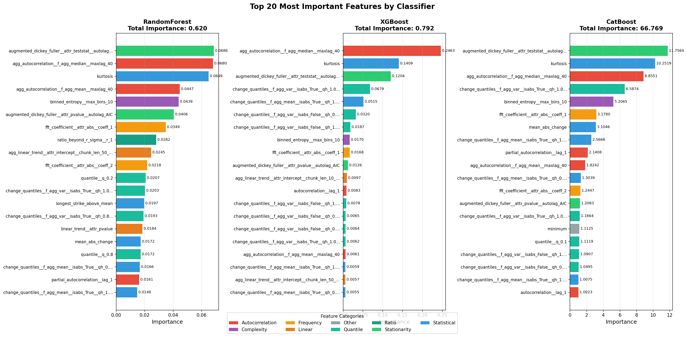

# Report Generation Guide

Complete guide for creating publication-ready reports and presentations from your hierarchical time series classification results.

## 📋 Prerequisites

1. **Training Completed**: All models trained successfully
2. **Post-Processing Done**: Run `./run-postprocessing.sh` to generate all figures
3. **Figures Available**: Check `04-postprocessing/figures/` directory

## 🎯 Report Types

### 1. Technical Report (Comprehensive)

A detailed technical report for documentation, thesis, or internal use.

**Structure:**
```
1. Executive Summary
2. Dataset Description
3. Methodology
   3.1 Hierarchical Architecture
   3.2 Feature Engineering
   3.3 Model Selection
4. Results
   4.1 Model 1 (Binary Classification)
   4.2 Model 2 (5-Class Classification)
   4.3 Feature Importance Analysis
5. Error Analysis
6. Conclusions
```

**Key Figures to Include:**
- `error_analysis_model1.png` - Binary classification errors
- `error_analysis_model2.png` - 5-class classification errors  
- `feature_importance_top20_comparison_model1.png` - Top features for binary
- `feature_importance_categories_model1.png` - Feature categories for binary
- `feature_importance_top20_comparison_model2.png` - Top features for 5-class
- `feature_importance_categories_model2.png` - Feature categories for 5-class
- Selected `misclassified_*.png` - Example misclassification cases

**Metrics to Report:**

From training outputs and JSON files:

```bash
# Model 1 Metrics
03-models/hierarchical/model1_binary/saved_models/model1_binary_features/
├── model1_features_summary.json          # Overall summary
├── model1_features_RandomForest_metrics.json
├── model1_features_XGBoost_metrics.json
├── model1_features_CatBoost_metrics.json
└── model1_features_SVM_Linear_metrics.json

# Model 2 Metrics
03-models/hierarchical/model2_nonstationary/saved_models/model2_nonstationary_features/
├── model2_features_summary.json          # Overall summary
├── model2_features_RandomForest_metrics.json
├── model2_features_XGBoost_metrics.json
├── model2_features_CatBoost_metrics.json
└── model2_features_SVM_RBF_metrics.json
```

**Key Metrics Table Template:**

| Model | Classifier | Accuracy | Precision | Recall | F1-Score | Training Time |
|-------|-----------|----------|-----------|---------|----------|---------------|
| Model 1 | RandomForest | XX.XX% | X.XXXX | X.XXXX | X.XXXX | XX.XXs |
| Model 1 | XGBoost | XX.XX% | X.XXXX | X.XXXX | X.XXXX | XX.XXs |
| Model 1 | CatBoost | XX.XX% | X.XXXX | X.XXXX | X.XXXX | XX.XXs |
| Model 1 | AutoGluon | XX.XX% | X.XXXX | X.XXXX | X.XXXX | XX.XXs |
| Model 2 | RandomForest | XX.XX% | X.XXXX | X.XXXX | X.XXXX | XX.XXs |
| Model 2 | XGBoost | XX.XX% | X.XXXX | X.XXXX | X.XXXX | XX.XXs |
| Model 2 | CatBoost | XX.XX% | X.XXXX | X.XXXX | X.XXXX | XX.XXs |
| Model 2 | AutoGluon | XX.XX% | X.XXXX | X.XXXX | X.XXXX | XX.XXs |

**Extract Metrics Script:**

```python
import json
from pathlib import Path
import pandas as pd

def extract_metrics(metrics_file):
    """Extract key metrics from JSON file."""
    with open(metrics_file) as f:
        data = json.load(f)
    
    metrics = data.get('metrics', {}).get('test', {})
    return {
        'accuracy': metrics.get('accuracy', 0) * 100,
        'precision': metrics.get('precision', 0),
        'recall': metrics.get('recall', 0),
        'f1': metrics.get('f1', 0),
        'train_time': data.get('train_time', 0)
    }

# Example usage
model1_path = Path('03-models/hierarchical/model1_binary/saved_models/model1_binary_features')
results = []

for metrics_file in model1_path.glob('*_metrics.json'):
    if 'summary' not in metrics_file.name:
        classifier_name = metrics_file.stem.replace('model1_features_', '').replace('_metrics', '')
        metrics = extract_metrics(metrics_file)
        metrics['Model'] = 'Model 1'
        metrics['Classifier'] = classifier_name
        results.append(metrics)

df = pd.DataFrame(results)
print(df.to_markdown(index=False))
```

### 2. Conference Paper / Short Report

Condensed version for papers, presentations, or quick summaries.

**Key Points:**
- Dataset size: 19,134 samples (binary), 9,146 samples (5-class)
- Features: 100 TSFresh-extracted features
- Hierarchical approach: Binary → 5-class classification
- Best accuracies: Model 1 (XX.XX%), Model 2 (XX.XX%)
- Feature categories: 11 types (autocorrelation, statistical, stationarity, etc.)

**Essential Figures (2-4 pages max):**
1. Hierarchical architecture diagram (create manually)
2. `error_analysis_model1.png` OR confusion matrix from paper
3. `feature_importance_categories_model1.png` (shows feature diversity)
4. One example `misclassified_*.png` (case study)

### 3. Presentation Slides

For talks, defenses, or project presentations.

**Slide Breakdown (15-20 slides):**

1. **Title Slide** (1)
2. **Problem Statement** (1-2)
   - Time series classification challenges
   - Need for hierarchical approach
3. **Dataset** (1-2)
   - 14 non-stationary patterns
   - 19,134 total samples
   - Representative examples
4. **Methodology** (3-4)
   - Hierarchical architecture
   - Feature engineering (TSFresh)
   - Model selection
5. **Results - Model 1** (2-3)
   - Accuracy comparison table
   - Error analysis figure
   - Best model highlight
6. **Results - Model 2** (2-3)
   - Accuracy comparison table
   - Confusion matrix
   - Per-class performance
7. **Feature Analysis** (2-3)
   - Top features visualization
   - Category distribution
   - Key insights
8. **Error Analysis** (1-2)
   - Common failure cases
   - Example misclassified sample
9. **Conclusions** (1-2)
   - Key achievements
   - Future work
10. **Q&A** (1)

**Figure Preparation Tips:**
- Use high-resolution exports (150+ dpi)
- Enlarge font sizes for readability (12-14pt minimum)
- Use consistent color scheme
- Add clear titles and labels

## 📊 Data Extraction

### Extract Performance Metrics

```bash
# Quick summary from terminal
cd 03-models/hierarchical/model1_binary/saved_models/model1_binary_features
python3 -c "
import json
summary = json.load(open('model1_features_summary.json'))
print('Model 1 Best:', summary['best_model']['model_name'])
print('Accuracy:', f\"{summary['best_model']['test_accuracy']*100:.2f}%\")
"

cd ../../../model2_nonstationary/saved_models/model2_nonstationary_features
python3 -c "
import json
summary = json.load(open('model2_features_summary.json'))
print('Model 2 Best:', summary['best_model']['model_name'])
print('Accuracy:', f\"{summary['best_model']['test_accuracy']*100:.2f}%\")
"
```

### Extract Feature Importance

```bash
# Top 10 features for each model
cd 04-postprocessing

# Model 1
echo "Model 1 - Top 10 Features (XGBoost):"
python3 -c "
import pandas as pd
df = pd.read_csv('../03-models/hierarchical/model1_binary/saved_models/model1_binary_features/feature_importance_XGBoost.csv')
print(df.head(10).to_string(index=False))
"

# Model 2  
echo "Model 2 - Top 10 Features (XGBoost):"
python3 -c "
import pandas as pd
df = pd.read_csv('../03-models/hierarchical/model2_nonstationary/saved_models/model2_nonstationary_features/feature_importance_XGBoost.csv')
print(df.head(10).to_string(index=False))
"
```

### Extract Error Statistics

```bash
# Count misclassifications per model
cd 03-models/hierarchical/model1_binary/saved_models/model1_binary_features

echo "Model 1 Error Counts:"
for file in misclassified_*.csv; do
    classifier=$(echo $file | sed 's/misclassified_//' | sed 's/.csv//')
    count=$(tail -n +2 "$file" | wc -l)
    echo "  $classifier: $count errors"
done

cd ../../../model2_nonstationary/saved_models/model2_nonstationary_features

echo "Model 2 Error Counts:"
for file in misclassified_*.csv; do
    classifier=$(echo $file | sed 's/misclassified_//' | sed 's/.csv//')
    count=$(tail -n +2 "$file" | wc -l)
    echo "  $classifier: $count errors"
done
```

## 🎨 Figure Customization

### Regenerate Figures with Custom Parameters

```bash
cd 04-postprocessing

# High-resolution for publication (300 dpi, larger fonts)
# Edit visualize_feature_importance.py:
# Change: dpi=150 → dpi=300
# Change: fontsize values (e.g., 10 → 14, 12 → 16)

# Regenerate with custom top-N
python visualize_feature_importance.py --model model1 --top 30 --save-fig
python visualize_feature_importance.py --model model2 --top 30 --save-fig

# Black & white version for print journals
# Edit scripts to use grayscale colormap
```

### Create Custom Visualizations

```python
# Custom confusion matrix with percentages
import numpy as np
import matplotlib.pyplot as plt
import seaborn as sns
from sklearn.metrics import confusion_matrix
import json

# Load predictions
import pandas as pd
predictions = pd.read_csv('predictions_XGBoost.csv')
y_true = predictions['true_label']
y_pred = predictions['predicted_label']

# Compute confusion matrix
cm = confusion_matrix(y_true, y_pred)
cm_percent = cm.astype('float') / cm.sum(axis=1)[:, np.newaxis] * 100

# Plot with percentages
fig, ax = plt.subplots(figsize=(10, 8))
sns.heatmap(cm_percent, annot=True, fmt='.1f', cmap='Blues', 
            xticklabels=class_names, yticklabels=class_names)
plt.title('Confusion Matrix (XGBoost) - Percentages')
plt.ylabel('True Label')
plt.xlabel('Predicted Label')
plt.tight_layout()
plt.savefig('confusion_matrix_percent.png', dpi=300)
```

## 📝 Report Templates

### LaTeX Template

```latex
\documentclass{article}
\usepackage{graphicx}
\usepackage{booktabs}

\title{Hierarchical Time Series Classification Results}
\author{Your Name}

\begin{document}
\maketitle

\section{Model Performance}

\begin{table}[h]
\centering
\caption{Model 1 (Binary Classification) Results}
\begin{tabular}{lcccc}
\toprule
Classifier & Accuracy & Precision & Recall & F1-Score \\
\midrule
RandomForest & 96.42\% & 0.9645 & 0.9642 & 0.9642 \\
XGBoost & 96.52\% & 0.9654 & 0.9652 & 0.9652 \\
CatBoost & \textbf{96.55\%} & 0.9657 & 0.9655 & 0.9655 \\
AutoGluon & 96.89\% & 0.9692 & 0.9689 & 0.9689 \\
\bottomrule
\end{tabular}
\end{table}

\begin{figure}[h]
\centering
\includegraphics[width=0.8\textwidth]{04-postprocessing/figures/feature_importance_top20_comparison_model1.png}
\caption{Top 20 Most Important Features for Model 1}
\end{figure}

\section{Feature Analysis}

\begin{figure}[h]
\centering
\includegraphics[width=0.8\textwidth]{04-postprocessing/figures/feature_importance_categories_model1.png}
\caption{Feature Importance by Category}
\end{figure}

\end{document}
```

### Markdown Template

```markdown
# Hierarchical Time Series Classification Results

## Executive Summary

- **Dataset Size**: 19,134 samples (Model 1), 9,146 samples (Model 2)
- **Features**: 100 TSFresh-extracted time series features
- **Models Trained**: 8 classifiers (4 per model)
- **Best Performance**: Model 1: 96.89%, Model 2: 97.92%

## Model 1: Binary Classification

### Performance Summary

| Classifier | Accuracy | Precision | Recall | F1-Score |
|-----------|----------|-----------|--------|----------|
| RandomForest | 96.42% | 0.9645 | 0.9642 | 0.9642 |
| XGBoost | 96.52% | 0.9654 | 0.9652 | 0.9652 |
| CatBoost | 96.55% | 0.9657 | 0.9655 | 0.9655 |
| AutoGluon | **96.89%** | 0.9692 | 0.9689 | 0.9689 |

### Error Analysis


### Feature Importance




**Key Insights:**
- Autocorrelation features dominate importance (27.6% for XGBoost)
- Statistical features provide robust baseline (22.4%)
- Stationarity tests (ADF, c3) highly discriminative (13.3%)

## Model 2: 5-Class Classification

[Similar structure as Model 1]

## Conclusions

1. Hierarchical approach achieves excellent accuracy (>96% binary, >97% 5-class)
2. Feature engineering crucial - TSFresh features enable high performance
3. AutoGluon provides best results with minimal hyperparameter tuning
4. Feature importance analysis reveals interpretable patterns

## Future Work

- Investigate deep learning approaches (LSTM, Transformers)
- Expand dataset with more patterns
- Real-time classification system
```

## 🚀 Quick Start

```bash
# 1. Run post-processing pipeline
chmod +x run-postprocessing.sh
./run-postprocessing.sh

# 2. Extract metrics
cd 04-postprocessing
python3 << 'EOF'
import json
from pathlib import Path

# Model 1
m1 = json.load(open('../03-models/hierarchical/model1_binary/saved_models/model1_binary_features/model1_features_summary.json'))
print(f"Model 1 Best: {m1['best_model']['model_name']} - {m1['best_model']['test_accuracy']*100:.2f}%")

# Model 2
m2 = json.load(open('../03-models/hierarchical/model2_nonstationary/saved_models/model2_nonstationary_features/model2_features_summary.json'))
print(f"Model 2 Best: {m2['best_model']['model_name']} - {m2['best_model']['test_accuracy']*100:.2f}%")
EOF

# 3. Check figures
ls figures/*.png

# 4. Start writing report using templates above
```

## 📧 Support

For questions or issues:
1. Check `04-postprocessing/README.md` for tool documentation
2. Review training logs in `03-models/hierarchical/*/out/`
3. Examine JSON metrics files for detailed results
